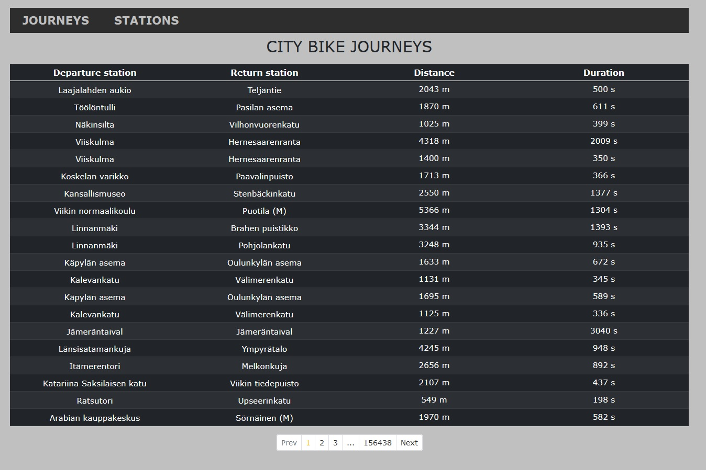
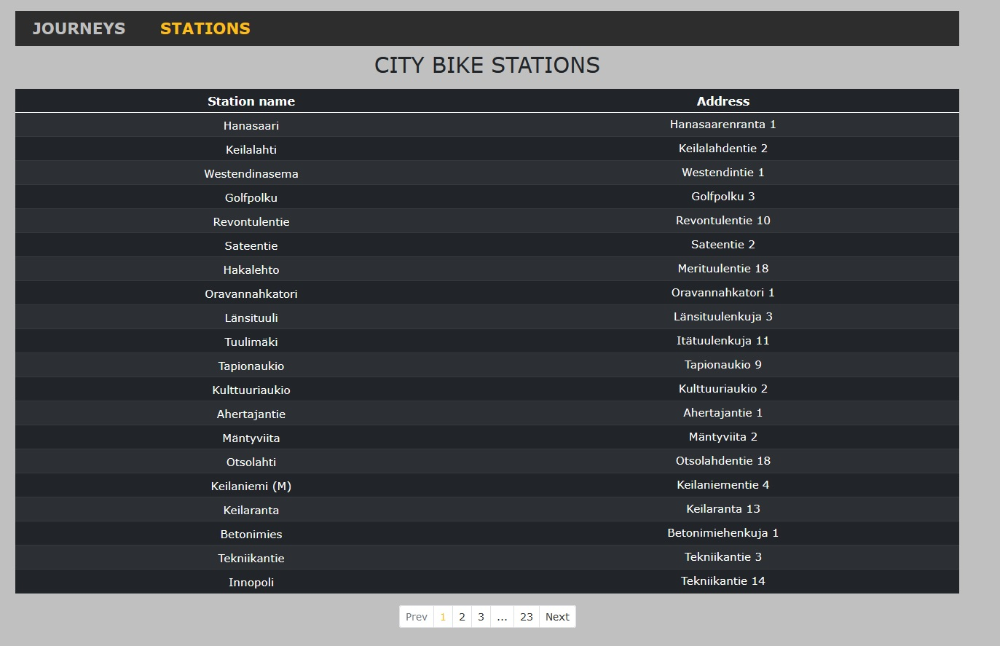
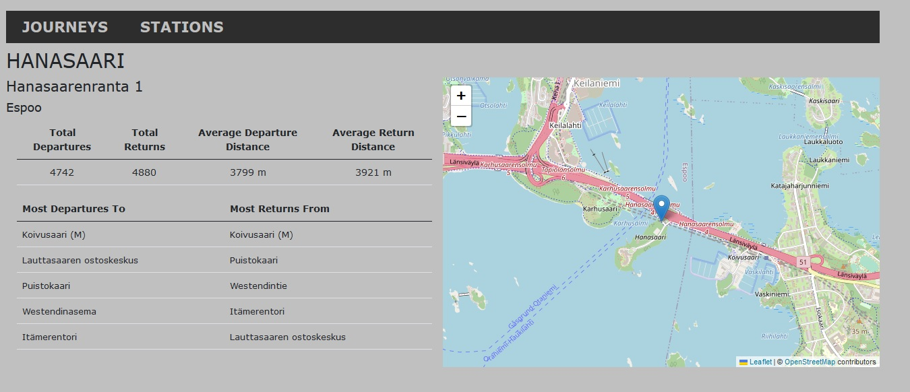

# Helsinki City Bike App

Solita 2023 pre-assignment for the Dev Academy 2023\
More info for the assignment @ https://github.com/solita/dev-academy-2023-exercise.

## Description

Helsinki City Bike app which visualizes the usage of city bikes in the capital region of Finland. With the
app you can view information of journeys and stations in simple lists and by clicking a station name anywhere in
the app, you can get descriptive details about the clicked station with map of the location provided.

## Tech Used

 * [PostgreSQL](https://www.postgresql.org/)
 * [Express](https://expressjs.com/)
 * [React](https://reactjs.org/)
 * [Node](https://nodejs.org/en/)

## Features

### Journey View

<br>

- List of all bike journeys with departure stations, return stations, covered distance in meters and the duration of the journey in seconds
- Pagination

### Station View

<br>

- List of all the stations with the address of the station
- Pagination

### Single Station View

<br>

- Station name
- Station address
- Total number of journeys starting from the station
- Total number of journeys ending at the station
- The average distance of a journey starting from the station in meters
- The average distance of a journey ending at the station in meters
- Station location on map
- Top 5 most popular return stations for journeys starting from the station
- Top 5 most popular departure stations for journeys ending at the station
- Ability to select one of the top stations and see their information

## Getting started

To get your local copy up and running follow these steps

### With Docker

1. Clone the repository with
  ```sh
  git clone https://github.com/jugipe/helcitybiker.git
  ```

2. Inside the repository if you want the app to load the data, run backend with
  ```sh
  docker-compose up -d
  ```
  Wait for a minute or two depending on your internet connection for the app to load the data and go to step 3.

2. If you want to add the data manually
    - Create ```files``` folder inside ```server/src```. 
    - Inside ```files``` create folder ````journeydata```` and ```stationdata```.
    - Add the following to ```files/journeydata```
        * <https://dev.hsl.fi/citybikes/od-trips-2021/2021-05.csv>
        * <https://dev.hsl.fi/citybikes/od-trips-2021/2021-06.csv>
        * <https://dev.hsl.fi/citybikes/od-trips-2021/2021-07.csv>
    - Add the following to ```files/stationdata```
        * <https://opendata.arcgis.com/datasets/726277c507ef4914b0aec3cbcfcbfafc_0.csv>
    - Then run 
      ```sh
        docker-compose up -d
      ```

3. Head to frontend with
      ```sh
        cd client/
      ```

4. In the frontend directory install depencies with
      ```sh
        npm i
      ```

5. Run frontend with
      ```sh
        npm start
      ```
6. Browser will start automatically, if not click -> http://localhost:3000

### Without docker

1. Setup postgres database if you dont already have one, you can get it from https://www.postgresql.org/download/.
2. Make sure you have atleast one database, you can use the default postgres database. If you want to run the api integration
   tests make another database for testing purposes.
3. Clone the repository with
  ```sh
  git clone https://github.com/jugipe/helcitybiker.git
  ```
4. Head to backend folder with 
      ```sh
        cd client/
      ```
5. Install depencies with 
      ```sh
        npm i
      ```
6. Make a ```.env.dev``` file in the ```server``` folder, for tests make a ```.env.test``` file in the same folder
7. Provide the next variables in the .env files for example:
```sh
    API_PORT= port you want your api to use i.e "9001"
    DB_USER= db username i.e "postgres"
    DB= name of the database i.e "postgres"
    DB_PW = password to db i.e "secret"
    DB_PORT= port number you want to use i.e 5432
    DB_HOST= db hostname i.e "localhost"
```
8. If you want to manually add the data, follow the steps mentioned in "With Docker" section in point 2. If you want the app to load the data skip this section 
10. Head to frontend directory with
      ```sh
        cd .. && cd client/
      ```
10. Install depencies with
      ```sh
        npm i 
      ```
11. Go back to root folder and install depencies with
      ```sh
        cd .. && npm i
      ```
12. Run the app with
      ```sh
        npm run dev:populate
      ```
13. Browser will start automatically, if not click -> http://localhost:3000
    - If you see a ```Unable to fetch data``` message, wait for a minute or two and hit refresh
    - It means that you didn't manually insert the data and backend is still loading the data


### Todo / Future improvements
- Add searching and filtering to Journey and Station Views
- Run backend in cloud
- Implement E2E tests

